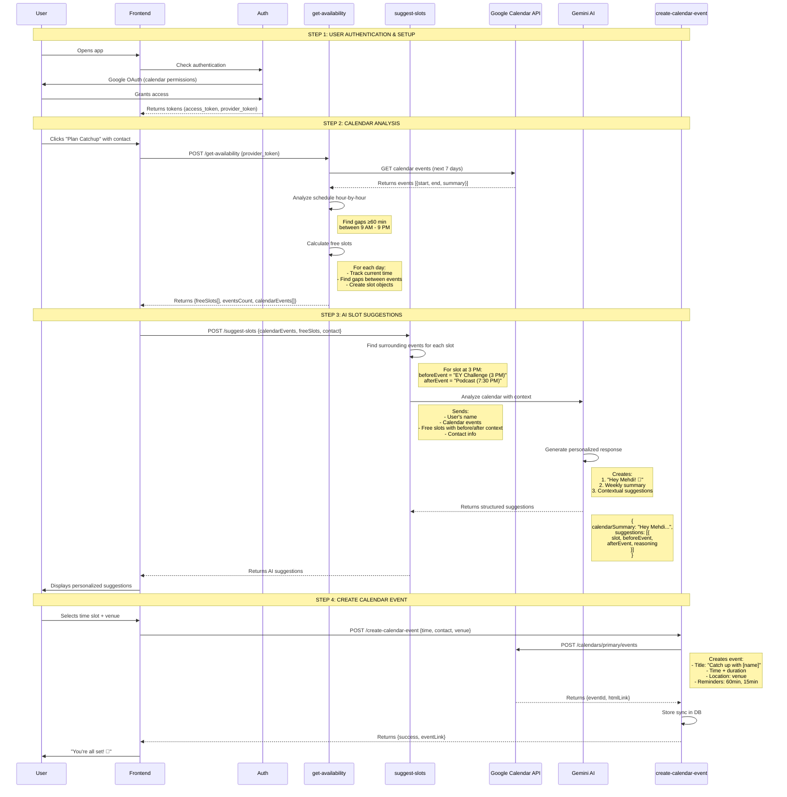

# CatchUp AI Agent Workflow Explained

## Overview
The CatchUp app uses a multi-step AI agent workflow to analyze your calendar, suggest optimal meeting times with rich context, and create calendar events. Here's exactly how it works:

---

## 🔄 Complete Workflow Diagram



---

## 📋 Detailed Step-by-Step Breakdown

### STEP 1: Authentication & Setup
**What happens:**
1. User signs in with Google OAuth
2. App requests calendar permissions (`calendar.readonly`, `calendar.events`)
3. Google returns two tokens:
   - `access_token`: Authenticates with Supabase
   - `provider_token`: Accesses Google Calendar API

**Why it matters:**
- The `provider_token` allows reading your calendar
- Without it, the AI can't analyze your schedule

---

### STEP 2: Calendar Analysis (`get-availability`)
**What happens:**

#### 2.1 Fetch Raw Events
```typescript
// Call Google Calendar API
GET /calendars/primary/events?
  timeMin=2026-01-20T22:00:00Z&
  timeMax=2026-01-27T22:00:00Z&
  singleEvents=true&
  orderBy=startTime
```

**Returns your events:**
```json
[
  {
    "summary": "EY AI Challenge",
    "start": "2026-01-22T15:00:00+01:00",
    "end": "2026-01-22T16:00:00+01:00"
  },
  {
    "summary": "Antonin podcast",
    "start": "2026-01-22T19:30:00+01:00",
    "end": "2026-01-22T20:30:00+01:00"
  }
]
```

#### 2.2 Find Free Slots Algorithm
```typescript
function findFreeSlots(events, daysAhead = 7) {
  const freeSlots = [];
  
  // For each day in the next 7 days
  for (let day = 0; day < daysAhead; day++) {
    const dayStart = new Date(currentDay);
    dayStart.setHours(9, 0, 0, 0);  // 9 AM
    
    const dayEnd = new Date(currentDay);
    dayEnd.setHours(21, 0, 0, 0);   // 9 PM
    
    let currentTime = dayStart;
    
    // For each event that day
    for (const event of dayEvents) {
      const eventStart = new Date(event.start);
      
      // If there's a gap before this event
      if (currentTime < eventStart) {
        const gapMinutes = (eventStart - currentTime) / 60000;
        
        // Only suggest slots ≥ 60 minutes
        if (gapMinutes >= 60) {
          freeSlots.push({
            start: currentTime,
            end: eventStart,
            duration: gapMinutes
          });
        }
      }
      
      currentTime = event.end;
    }
    
    // Add remaining time in the day
    if (currentTime < dayEnd) {
      const remaining = (dayEnd - currentTime) / 60000;
      if (remaining >= 60) {
        freeSlots.push({
          start: currentTime,
          end: dayEnd,
          duration: remaining
        });
      }
    }
  }
  
  return freeSlots.slice(0, 5);  // Top 5 slots
}
```

**Example output:**
```json
{
  "freeSlots": [
    {
      "start": "2026-01-21T09:00:00Z",
      "end": "2026-01-21T21:00:00Z",
      "duration": 720  // 12 hours - all day free!
    },
    {
      "start": "2026-01-22T09:00:00Z",
      "end": "2026-01-22T14:00:00Z",
      "duration": 300  // 5 hours before EY event
    }
  ],
  "calendarConnected": true,
  "eventsCount": 3
}
```

---

### STEP 3: AI Slot Suggestions (`suggest-slots`)
**What happens:**

#### 3.1 Find Surrounding Events
For each free slot, identify what's immediately before and after:

```typescript
function findSurroundingEvents(slot) {
  const slotStart = new Date(slot.start);
  const slotEnd = new Date(slot.end);
  
  // Events that end before this slot starts
  const eventsBefore = events.filter(e => 
    new Date(e.end) <= slotStart
  );
  const beforeEvent = eventsBefore[eventsBefore.length - 1];
  
  // First event that starts after this slot ends
  const afterEvent = events.find(e => 
    new Date(e.start) >= slotEnd
  );
  
  return { beforeEvent, afterEvent };
}
```

**Example:**
- **Slot:** 3:00 PM - 6:30 PM
- **Before:** EY AI Challenge (ends 4 PM) ❌ Wait, this overlaps!
- **After:** Antonin podcast (starts 7:30 PM) ✅

#### 3.2 Send to Gemini AI
```typescript
// The AI receives:
{
  contact: { name: "John Doe", context: "Met at startup event" },
  calendarEvents: [
    { summary: "EY AI Challenge", start: "2026-01-22T15:00:00Z" },
    { summary: "Antonin podcast", start: "2026-01-22T19:30:00Z" }
  ],
  freeSlots: [
    {
      start: "2026-01-22T15:00:00Z",
      end: "2026-01-22T18:30:00Z",
      beforeEvent: { summary: "EY AI Challenge", time: "Wed 3:00 PM" },
      afterEvent: { summary: "Antonin podcast", time: "Wed 7:30 PM" }
    }
  ]
}

// AI Prompt includes:
`Hey Mehdi! 👋 
Your events: EY AI Challenge @ 3 PM, Antonin podcast @ 7:30 PM
Available slot: Wed 3 PM - 6:30 PM (After: EY Challenge | Before: Podcast)

Provide rich reasoning considering:
- Time of day (afternoon = relaxed, good energy)
- Relation to events (buffer time after challenge)
- Practical aspects (perfect for coffee)
- Flow of day (gives breathing room)`
```

#### 3.3 AI Response
```json
{
  "calendarSummary": "Hey Mehdi! 👋 You've got the EY AI Challenge Wednesday afternoon and your podcast with Antonin that evening. Here's when works best:",
  "suggestions": [
    {
      "slot": "Wed Jan 22, 3:00 PM - 6:30 PM",
      "beforeEvent": "EY AI Challenge (3:00 PM)",
      "afterEvent": "Antonin podcast (7:30 PM)",
      "reasoning": "Perfect afternoon slot! You'll wrap up your EY Challenge and can grab a coffee before your evening podcast. Mid-afternoon is ideal - past the lunch rush, plenty of energy, relaxed vibe for great conversation."
    }
  ]
}
```

---

### STEP 4: Create Calendar Event (`create-calendar-event`)
**What happens:**

#### 4.1 User Selects Slot
```typescript
// User clicks: "Wednesday 3 PM" + "Café de Flore"
{
  catchupId: "uuid",
  contactName: "John Doe",
  scheduledTime: "2026-01-22T15:00:00Z",
  durationMinutes: 60,
  placeName: "Café de Flore",
  message: "Catch up about startup ideas"
}
```

#### 4.2 Create Google Calendar Event
```typescript
POST https://www.googleapis.com/calendar/v3/calendars/primary/events

{
  "summary": "Catch up with John Doe",
  "description": "Catch up about startup ideas",
  "start": {
    "dateTime": "2026-01-22T15:00:00+01:00",
    "timeZone": "Europe/Paris"
  },
  "end": {
    "dateTime": "2026-01-22T16:00:00+01:00",
    "timeZone": "Europe/Paris"
  },
  "location": "Café de Flore",
  "reminders": {
    "overrides": [
      { "method": "popup", "minutes": 60 },
      { "method": "popup", "minutes": 15 }
    ]
  }
}
```

#### 4.3 Google Response
```json
{
  "id": "abc123xyz",
  "htmlLink": "https://calendar.google.com/calendar/event?eid=...",
  "status": "confirmed"
}
```

#### 4.4 Store in Database
```sql
INSERT INTO calendar_events (user_id, catchup_id, google_event_id)
VALUES ('user-uuid', 'catchup-uuid', 'abc123xyz');
```

---

## 🧠 How the AI Agent "Thinks"

### Input Processing
1. **Reads your calendar** - Sees all your events
2. **Identifies patterns** - Busy days, free days, clusters of meetings
3. **Finds gaps** - Hour-by-hour analysis
4. **Adds context** - What's before/after each gap

### Decision Making
The AI considers:

**Temporal Factors:**
- ⏰ Time of day (morning = fresh, evening = relaxed)
- 📅 Day of week
- ⏳ Duration available

**Contextual Factors:**
- 📍 What's surrounding this slot
- 🧘 Buffer time after important meetings
- 🌊 Flow of your day

**Practical Factors:**
- ☕ Morning = coffee
- 🍽️ Lunch hours = meals
- 🍷 Evening = drinks/dinner

### Output Generation
Creates:
1. **Personal greeting** - Makes it conversational
2. **Weekly summary** - Shows understanding
3. **Ranked suggestions** - Best options first
4. **Rich reasoning** - Explains the "why"

---

## 🎯 Example: Complete Flow

**Your Calendar:**
```
Jan 21: Free all day (9 AM - 9 PM)
Jan 22: 
  - 9 AM - 2 PM: FREE
  - 3 PM - 4 PM: EY AI Challenge
  - 4 PM - 7:30 PM: FREE
  - 7:30 PM - 8:30 PM: Antonin podcast
  - 8:30 PM - 9 PM: FREE
```

**Step 1: Analysis finds 5 slots**
1. Jan 21: 9 AM - 9 PM (720 min)
2. Jan 22: 9 AM - 2 PM (300 min)
3. Jan 22: 4 PM - 6:30 PM (210 min) ← Note: After challenge, before podcast
4. Jan 22: 8:30 PM - 9 PM (90 min)
5. Jan 23: 9 AM - 9 PM (720 min)

**Step 2: AI adds context**
```
Slot 3: 4 PM - 6:30 PM
  Before: EY AI Challenge (ending at 4 PM)
  After: Antonin podcast (starting 7:30 PM)
  
  Reasoning: "Perfect afternoon window! You just finished your 
  EY Challenge - great time to decompress with a coffee catchup 
  before your evening podcast. You'll have 3.5 hours of relaxed 
  time, ideal for meaningful conversation without rushing."
```

**Step 3: You select it**
- Time: 4 PM Wednesday
- Venue: Café de Flore (from AI suggestions)

**Step 4: Event created**
- ✅ Added to your Google Calendar
- ✅ Reminders set (60 min + 15 min)
- ✅ Stored in database
- ✅ You get confirmation link

---

## 🔑 Key Takeaways

1. **Multi-Agent System**
   - Each Edge Function is a specialized agent
   - They work together in sequence
   - Each adds intelligence to the process

2. **Context is King**
   - Not just "free at 3 PM"
   - But "free at 3 PM, after your challenge, before podcast, perfect for coffee"

3. **Personalization Matters**
   - Uses your name
   - Understands YOUR schedule
   - Speaks conversationally

4. **End-to-End Automation**
   - From calendar read → AI analysis → event creation
   - Minimal user effort required
   - AI handles the cognitive load

---

## 📊 Data Flow Summary

```
User's Google Calendar
    ↓
[get-availability] reads & analyzes
    ↓
Free slots + events
    ↓
[suggest-slots] + Gemini AI
    ↓
Personalized suggestions with context
    ↓
User selects time + venue
    ↓
[create-calendar-event] 
    ↓
Event in Google Calendar ✅
```

The entire workflow is designed to make planning effortless while maintaining the quality and context of human decision-making!
