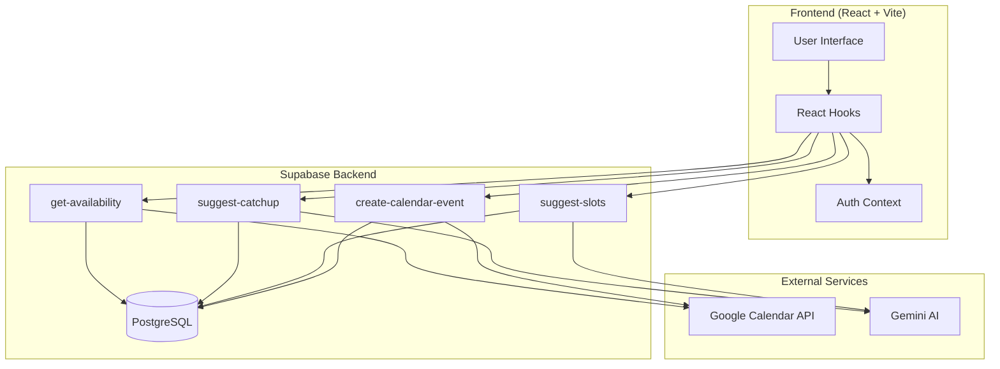
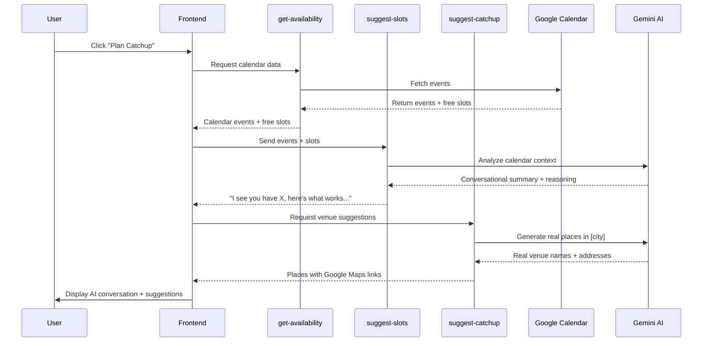
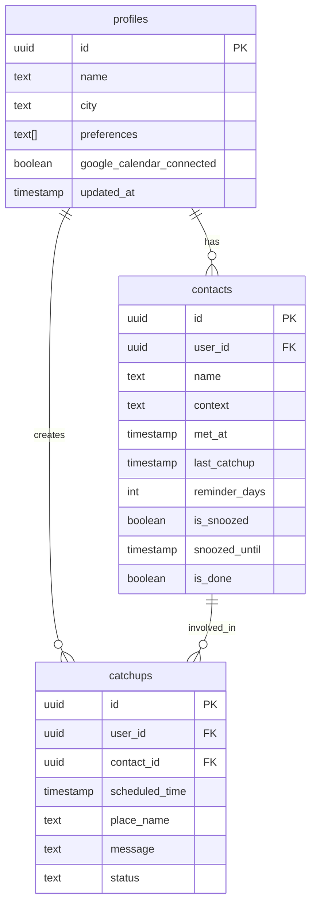

# CatchUp 🤝

An AI-powered relationship management app that helps you stay connected with the people who matter.

## 🎯 What It Does

CatchUp analyzes your Google Calendar and suggests optimal times to meet with your contacts. It uses AI to:
- Read your calendar events and find free slots
- Generate conversational suggestions about when to meet
- Recommend real venues in your city with Google Maps integration
- Filter out recently contacted people automatically

## 🏗️ Architecture



## 🔄 AI Suggestion Flow



## 🗄️ Database Schema



## 🛠️ Tech Stack

### Frontend
- **React 18** with TypeScript
- **Vite** for build tooling
- **TanStack Query** for data fetching
- **Tailwind CSS** + **Shadcn UI** for styling
- **Framer Motion** for animations

### Backend
- **Supabase**
  - PostgreSQL database
  - Edge Functions (Deno runtime)
  - Auth with Google OAuth
  - Row Level Security (RLS)

### AI & APIs
- **Google Gemini 1.5 Flash** for AI-powered suggestions
- **Google Calendar API** for event management
- **Google Maps** for venue links

## 🚀 Setup

### Prerequisites
```bash
node >= 18
npm or yarn
supabase CLI
```

### Installation

1. **Clone the repository**
```bash
git clone https://github.com/Mehdys/human-touch.git
cd human-touch
```

2. **Install dependencies**
```bash
npm install
```

3. **Set up environment variables**
```env
VITE_SUPABASE_URL=your_supabase_url
VITE_SUPABASE_ANON_KEY=your_anon_key
```

4. **Configure Google OAuth**
- Follow instructions in [google_oauth_setup.md](./google_oauth_setup.md)
- Add your OAuth credentials to Supabase Dashboard

5. **Deploy Edge Functions**
```bash
supabase functions deploy get-availability --project-ref your_project_ref --no-verify-jwt
supabase functions deploy suggest-catchup --project-ref your_project_ref --no-verify-jwt
supabase functions deploy suggest-slots --project-ref your_project_ref --no-verify-jwt
supabase functions deploy create-calendar-event --project-ref your_project_ref --no-verify-jwt
```

6. **Run migrations**
```bash
supabase db push
```

7. **Start development server**
```bash
npm run dev
```

## 📱 How It Works

### 1. **Add Contacts**
Quickly add people you've met with context about your relationship.

### 2. **AI Analysis**
The system automatically:
- Checks when you last caught up
- Analyzes your calendar availability
- Generates conversational suggestions

### 3. **Smart Scheduling**
Get real-time slot suggestions like:
> "I see you have a Team Meeting on Monday. Perfect timing would be Tuesday 7 PM after your dinner reservation wraps up."

### 4. **Venue Recommendations**
Real places in your city with direct Google Maps links to verify location, see photos, and check hours.

## 🔐 Security

- **Row Level Security (RLS)** on all tables
- **Google OAuth 2.0** for authentication
- **Edge Functions** validate user sessions
- **API keys** stored securely in environment variables

## 📊 Database Maintenance

Quick access to PostgreSQL:
```bash
./scripts/db.sh -c "SELECT * FROM contacts WHERE user_id = 'your_user_id';"
```

## 🤝 Contributing

This is a personal MVP project, but suggestions and feedback are welcome!

## 📄 License

MIT

---

**Built with ❤️ using React, Supabase, and Google Gemini AI**
